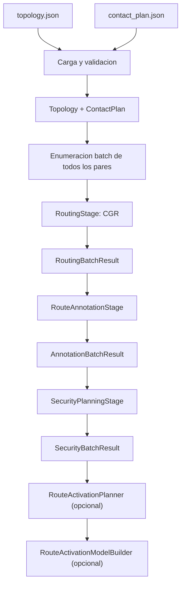

# BPSec Keys

Toolchain experimental para estudiar la relacion entre rutas temporales, dominios
de red y requerimientos criptograficos en escenarios DTN/Bundle Protocol con
BPSec. El proyecto integra calculo de rutas CGR, anotacion topologica de rutas,
planificacion de protecciones BPSec y, opcionalmente, optimizacion de activacion
de rutas en funcion de un presupuesto de llaves.

El objetivo principal es hacer explicito que informacion existe en cada punto
del pipeline: contactos disponibles, rutas candidatas, cruces entre redes,
operaciones de seguridad, requerimientos de llaves y restricciones de
activacion.

## Contenido

- [Arquitectura del proyecto](#arquitectura-del-proyecto)
- [Pipeline conceptual](#pipeline-conceptual)
- [Instalacion](#instalacion)
- [Uso rapido](#uso-rapido)
- [Escenarios incluidos](#escenarios-incluidos)
- [Uso desde Python](#uso-desde-python)
- [Formato de escenarios](#formato-de-escenarios)
- [Creacion de nuevos escenarios](#creacion-de-nuevos-escenarios)
- [Optimizacion de activacion de rutas](#optimizacion-de-activacion-de-rutas)
- [Modelo de seguridad](#modelo-de-seguridad)
- [Notas de desarrollo](#notas-de-desarrollo)

## Arquitectura del proyecto

```text
bpsec-keys/
├── main.py                         CLI con Typer
├── requirements.txt                Dependencias Python
├── pipelines/
│   ├── simulation.py               Orquestacion end-to-end del pipeline
│   ├── routing.py                  Interfaz de algoritmos de routing CGR
│   ├── security.py                 Pipeline de artefactos de seguridad
│   └── route_activation.py         Planificacion y restricciones de activacion
├── modules/
│   ├── network/
│   │   ├── topology.py             Carga y validacion de topologias
│   │   ├── py_cgr_lib.py           Fachada compatible para utilidades CGR
│   │   └── cgr/
│   │       ├── loader.py           Carga de contact plans
│   │       ├── models.py           Contact, Route y Bundle
│   │       └── algorithms.py       cgr_yen, cgr_dijkstra, etc.
│   └── security/
│       ├── annotated_routes.py     Enriquecimiento topologico de rutas
│       ├── planning.py             Generacion de ProtectionPlan
│       ├── keys.py                 KeyScope, KeyRequirement e inventario
│       ├── roles.py                Roles de nodos en hops y fronteras
│       └── models.py               Enums de modelos, servicios y llaves
└── scenarios/examples/
    ├── basic/                      Escenario lineal de 12 nodos y 3 redes
    └── two_planes_polar/           Escenario de dos planos con ventanas polares
```

La capa `modules/` contiene modelos y algoritmos de dominio. La capa
`pipelines/` encapsula el flujo de procesamiento mediante clases reutilizables
orientadas a ejecucion batch:

- `RoutingStage`: calcula rutas para todos los pares ordenados del escenario.
- `RouteAnnotationStage`: transforma rutas CGR en rutas anotadas con informacion
  de red.
- `SecurityPlanningStage`: genera planes de proteccion por modelo de seguridad.
- `SimulationPipeline`: orquesta carga, routing, anotacion y seguridad.
- `SecurityPipeline`: API directa para construir artefactos de seguridad.
- `RouteActivationPlanner`: extrae requerimientos de llaves por ruta y por
  corrida batch.
- `RouteActivationModelBuilder`: crea variables y restricciones Gurobi.

Las funciones historicas (`run_simulation`, `compute_routes_for_pairs`,
`build_security_batch`, etc.) se mantienen como wrappers para compatibilidad.

## Pipeline conceptual



Cada etapa produce artefactos inspeccionables:

| Etapa | Input principal | Output principal | Informacion agregada |
|---|---|---|---|
| Carga | JSON de topologia y contactos | `Topology`, `list[Contact]` | Validacion, indices nodo-red, volumen por contacto |
| Routing | Contactos, topologia, tiempo actual | `RoutingBatchResult` | `pairs`, `routes_by_pair`, delivery time, volumen |
| Anotacion | Rutas + topologia | `AnnotationBatchResult` | `node_path`, `network_path`, gateways, cruces de frontera |
| Seguridad | Rutas anotadas + modelo | `SecurityBatchResult` | Operaciones BPSec, acciones por nodo, requerimientos de llaves |
| Activacion | Planes de proteccion | `RouteActivationPlanning` | Llaves unicas requeridas por ruta |
| Optimizacion | Planning + restricciones | Modelo Gurobi | Rutas y llaves seleccionadas |

## Instalacion

Requisitos:

- Python 3.11 o superior recomendado.
- `pydantic` para validacion de datos.
- `typer` para la CLI.
- `gurobipy` para los ejemplos de optimizacion. La simulacion principal no
  requiere resolver modelos Gurobi, pero los scripts de activacion si.

Crear un entorno virtual e instalar dependencias:

```bash
python -m venv .venv
source .venv/bin/activate
pip install -r requirements.txt
```

Validar que el proyecto compila:

```bash
python -m compileall pipelines modules main.py scenarios/examples
```

## Uso rapido

Mostrar comandos disponibles:

```bash
python main.py --help
```

Cargar el escenario basico y reportar tamanos:

```bash
python main.py load \
  --cp-path scenarios/examples/basic/contact_plan.json \
  --topology-path scenarios/examples/basic/topology.json
```

Resumir el routing batch completo:

```bash
python main.py routing-batch \
  --cp-path scenarios/examples/basic/contact_plan.json \
  --topology-path scenarios/examples/basic/topology.json \
  --curr-time 0 \
  --num-routes 3
```

Resumir seguridad batch para un modelo:

```bash
python main.py security-batch \
  --model edge_to_edge \
  --cp-path scenarios/examples/basic/contact_plan.json \
  --topology-path scenarios/examples/basic/topology.json
```

Inspeccionar la topologia:

```bash
python main.py topology-info \
  --topology-path scenarios/examples/basic/topology.json

python main.py topology-info \
  --topology-path scenarios/examples/basic/topology.json \
  --node 5

python main.py topology-info \
  --topology-path scenarios/examples/basic/topology.json \
  --network 2
```

La CLI escribe sus resultados mediante logging. Los scripts de escenarios usan
`print` para producir salidas tabulares mas convenientes para exploracion.

## Escenarios incluidos

### `scenarios/examples/basic`

Escenario lineal de 12 nodos distribuidos en 3 redes:

- Red 1: nodos `1, 2, 3, 4`
- Red 2: nodos `5, 6, 7, 8`
- Red 3: nodos `9, 10, 11, 12`

El contact plan contiene contactos unidireccionales encadenados:

```text
1 -> 2 -> 3 -> 4 -> 5 -> 6 -> 7 -> 8 -> 9 -> 10 -> 11 -> 12
```

Comandos utiles:

```bash
python scenarios/examples/basic/run.py
python scenarios/examples/basic/show_node_keys.py
python scenarios/examples/basic/optimize_route_activation.py
python scenarios/examples/basic/sweep_route_activation_budget.py
```

Archivos generados o consumidos:

- `topology.json`: definicion de redes y nodos.
- `contact_plan.json`: contactos temporales.
- `run.py`: ejecuta el pipeline completo para todos los pares.
- `show_node_keys.py`: resume requerimientos de llaves por nodo/ruta/modelo.
- `optimize_route_activation.py`: maximiza rutas activas bajo presupuesto de
  llaves.
- `sweep_route_activation_budget.py`: barre presupuestos de llaves.
- `route_activation_budget.csv`: salida tabular del sweep.
- `route_activation_budget.svg`: visualizacion del sweep.

### `scenarios/examples/two_planes_polar`

Escenario de dos planos o grupos:

- Plano/red 1: nodos `1, 2, 3, 4, 5`
- Plano/red 2: nodos `6, 7, 8, 9, 10`

Dentro de cada plano, los contactos son permanentes durante la ventana de
simulacion. Entre planos existen contactos temporales que representan ventanas
de comunicacion polar.

Ejecutar:

```bash
python scenarios/examples/two_planes_polar/run.py
```

El script ejecuta el pipeline batch completo, pero reporta un subconjunto
curado de pares de interes y aplica el modelo `EDGE_TO_EDGE`, mostrando paths,
ventanas de contacto, gateways y cantidad de requerimientos.

## Uso desde Python

La interfaz recomendada es `SimulationPipeline`, siempre en modo batch:

```python
from modules.security.models import SecurityModelType
from pipelines.routing import CGRYenRouting
from pipelines.simulation import SimulationPipeline

pipeline = SimulationPipeline()

result = pipeline.run(
    cp_path="scenarios/examples/basic/contact_plan.json",
    topology_path="scenarios/examples/basic/topology.json",
    security_models=(SecurityModelType.EDGE_TO_EDGE,),
    curr_time=0,
    routing_algorithm=CGRYenRouting(max_routes=3),
    num_routes=3,
)

pair = (1, 9)
annotated_route = result.security.annotated_routes_by_pair[pair][0]
plan = result.security.plans_by_model[SecurityModelType.EDGE_TO_EDGE][pair][0]

print(annotated_route.node_path)
print(annotated_route.network_path)
print(annotated_route.boundary_crossings)
print(plan.operations)
print(plan.key_requirements)
```

Tambien se conserva la interfaz funcional:

```python
from pipelines.simulation import run_simulation

result = run_simulation(
    cp_path="scenarios/examples/basic/contact_plan.json",
    topology_path="scenarios/examples/basic/topology.json",
)
```

Para usar etapas individuales:

```python
from modules.network.cgr.loader import cp_load
from modules.network.topology import topology_load
from pipelines.simulation import RoutingStage, RouteAnnotationStage, SecurityPlanningStage

topology = topology_load("scenarios/examples/basic/topology.json")
contact_plan = cp_load("scenarios/examples/basic/contact_plan.json")

routing = RoutingStage().compute(
    topology=topology,
    contact_plan=contact_plan,
)
annotation = RouteAnnotationStage().annotate(routing)
security = SecurityPlanningStage().build_batch(annotation)
```

## Formato de escenarios

Un escenario esta compuesto, como minimo, por:

```text
scenarios/examples/<scenario_name>/
├── __init__.py
├── topology.json
├── contact_plan.json
└── run.py
```

### `topology.json`

La topologia puede escribirse como lista:

```json
[
  {
    "id": 1,
    "nodes": [1, 2, 3, 4]
  },
  {
    "id": 2,
    "nodes": [5, 6, 7, 8]
  }
]
```

O como objeto con clave `networks`:

```json
{
  "networks": [
    {
      "id": 1,
      "nodes": [1, 2, 3, 4]
    },
    {
      "id": 2,
      "nodes": [5, 6, 7, 8]
    }
  ]
}
```

Reglas de validacion:

- Cada red debe tener `id > 0`.
- Cada red debe incluir al menos un nodo.
- Cada nodo debe tener id positivo.
- No puede haber nodos duplicados dentro de una red.
- Un mismo nodo no puede aparecer en mas de una red.
- No puede haber ids de red duplicados.

### `contact_plan.json`

El contact plan puede escribirse como lista:

```json
[
  {
    "start": 0,
    "end": 600,
    "from": 1,
    "to": 6,
    "rate": 1000,
    "owlt": 2
  }
]
```

O como objeto con clave `contacts`:

```json
{
  "contacts": [
    {
      "start": 0,
      "end": 600,
      "from": 1,
      "to": 6,
      "rate": 1000,
      "owlt": 2
    }
  ]
}
```

Campos:

| Campo | Tipo | Significado |
|---|---|---|
| `start` | int | Inicio de la ventana de contacto |
| `end` | int | Fin de la ventana de contacto |
| `from` | int | Nodo transmisor |
| `to` | int | Nodo receptor |
| `rate` | int | Tasa de transmision |
| `owlt` | int | One-way light time o retardo de propagacion |

Reglas de validacion:

- `end` debe ser mayor que `start`.
- `rate` debe ser mayor que cero.
- `from` y `to` deben ser distintos.
- `owlt` debe ser mayor o igual que cero.

El volumen nominal del contacto se calcula como:

```text
volume = rate * (end - start)
```

## Creacion de nuevos escenarios

1. Crear un directorio:

```bash
mkdir -p scenarios/examples/my_scenario
touch scenarios/examples/my_scenario/__init__.py
```

2. Definir `topology.json`.

Ejemplo minimo:

```json
[
  {
    "id": 1,
    "nodes": [1, 2, 3]
  },
  {
    "id": 2,
    "nodes": [4, 5, 6]
  }
]
```

3. Definir `contact_plan.json`.

Ejemplo minimo:

```json
[
  { "start": 0, "end": 100, "from": 1, "to": 2, "rate": 1000, "owlt": 1 },
  { "start": 100, "end": 200, "from": 2, "to": 4, "rate": 1000, "owlt": 2 },
  { "start": 200, "end": 300, "from": 4, "to": 6, "rate": 1000, "owlt": 1 }
]
```

4. Crear un `run.py` siguiendo este patron:

```python
from pathlib import Path
import sys

REPO_ROOT = Path(__file__).resolve().parents[3]
if str(REPO_ROOT) not in sys.path:
    sys.path.insert(0, str(REPO_ROOT))

from modules.security.models import SecurityModelType
from pipelines.routing import CGRYenRouting
from pipelines.simulation import SimulationPipeline


DISPLAY_PAIRS = (
    (1, 6),
)


def main() -> None:
    scenario_dir = Path(__file__).resolve().parent

    result = SimulationPipeline().run(
        cp_path=str(scenario_dir / "contact_plan.json"),
        topology_path=str(scenario_dir / "topology.json"),
        security_models=(SecurityModelType.EDGE_TO_EDGE,),
        curr_time=0,
        routing_algorithm=CGRYenRouting(max_routes=3),
        num_routes=3,
    )

    for pair in DISPLAY_PAIRS:
        print(f"pair | {pair[0]}->{pair[1]}")
        for annotated in result.security.annotated_routes_by_pair[pair]:
            print(
                "route | id=%s nodes=%s networks=%s crossings=%d gateways=%s"
                % (
                    annotated.route_id,
                    list(annotated.node_path),
                    list(annotated.network_path),
                    len(annotated.boundary_crossings),
                    sorted(annotated.gateway_nodes),
                )
            )


if __name__ == "__main__":
    main()
```

5. Validar el escenario:

```bash
python scenarios/examples/my_scenario/run.py
python main.py topology-info --topology-path scenarios/examples/my_scenario/topology.json
python main.py routing-batch \
  --cp-path scenarios/examples/my_scenario/contact_plan.json \
  --topology-path scenarios/examples/my_scenario/topology.json
```

Recomendaciones metodologicas:

- Empezar con pocos nodos y contactos, y verificar manualmente las rutas
  esperadas.
- Agregar contactos bidireccionales explicitamente si se desea conectividad en
  ambos sentidos. El contact plan es direccional.
- Revisar `network_path` para confirmar que los cruces entre redes son los
  esperados.
- Comparar modelos de seguridad sobre la misma ruta antes de introducir
  optimizacion.
- Separar escenarios deterministas pequenos de escenarios grandes de barrido o
  sensibilidad.

## Optimizacion de activacion de rutas

La optimizacion toma el resultado batch de seguridad y extrae los scopes de
llaves necesarios para activar cada ruta.

El flujo es:

```python
from pipelines.route_activation import (
    RouteActivationPlanner,
    RouteActivationModelBuilder,
)

planning = RouteActivationPlanner().build_for_model(
    security_batch,
    model=security_model,
)
artifacts = RouteActivationModelBuilder().build_model(planning)
```

El modelo crea:

- `route_vars[route_id]`: variable binaria que indica si una ruta esta activa.
- `key_vars[key_scope]`: variable binaria que indica si una llave/scope esta
  activo.
- `route_constraints[route_id]`: restriccion que exige que una ruta activa
  tenga todas sus llaves requeridas activas.

La restriccion estructural es:

```text
sum(key_vars[scope] for scope in required_key_scopes)
    >= len(required_key_scopes) * route_var
```

El script `scenarios/examples/basic/optimize_route_activation.py` agrega una
restriccion de presupuesto:

```text
sum(key_vars) <= max_keys
```

y maximiza:

```text
sum(route_vars)
```

Esto permite comparar cuantos caminos pueden habilitarse bajo distintos modelos
de seguridad y presupuestos de llaves.

## Modelo de seguridad

Los modelos soportados son:

| Modelo | Descripcion | Tipo de llaves predominante |
|---|---|---|
| `HOP_BY_HOP` | Protege cada salto individualmente | `NODE_TO_NODE` |
| `END_TO_END` | Protege la ruta completa entre origen y destino | `NODE_TO_NODE` |
| `EDGE_BY_EDGE` | Protege segmentos intra-red y cruces entre redes | `NODE_TO_GROUP`, `GROUP_TO_GROUP` |
| `EDGE_TO_EDGE` | Protege bordes y transito entre dominio origen y destino | `NODE_TO_GROUP`, `GROUP_TO_GROUP` |

Cada `ProtectionPlan` contiene:

- `operations`: operaciones BPSec a aplicar.
- `node_requirements`: acciones requeridas por nodo.
- `key_requirements`: llaves necesarias para ejecutar las operaciones.
- `notes`: observaciones cuando un modelo degenera a un caso especial, por
  ejemplo rutas que permanecen dentro de una sola red.

Actualmente los planes usan el servicio `BCB`. El enum tambien contempla `BIB`,
pero la logica de planificacion existente se centra en proteccion BCB.

## Notas de desarrollo

Comandos utiles para verificacion:

```bash
python -m compileall pipelines modules main.py scenarios/examples
python scenarios/examples/basic/run.py
python scenarios/examples/two_planes_polar/run.py
python scenarios/examples/basic/optimize_route_activation.py
```

Convenciones de diseno:

- Mantener `modules/` enfocado en modelos y algoritmos de dominio.
- Mantener `pipelines/` enfocado en orquestacion y contratos entre etapas.
- Preferir clases de etapa cuando haya estado configurable o dependencias
  inyectables.
- Mantener wrappers funcionales cuando sea necesario preservar compatibilidad
  con scripts existentes.
- Agregar escenarios pequenos y reproducibles antes de escenarios grandes.

## Limitaciones conocidas

- El routing CGR opera sobre el contact plan; la topologia se usa para validar
  nodos y para interpretar rutas en terminos de redes, gateways y fronteras.
- Los contactos son direccionales. La conectividad inversa requiere contactos
  inversos explicitos.
- La optimizacion requiere `gurobipy` y una licencia disponible.
- Los outputs de scripts estan pensados para inspeccion humana y exploracion
  experimental; todavia no constituyen una interfaz estable de intercambio de
  datos.
